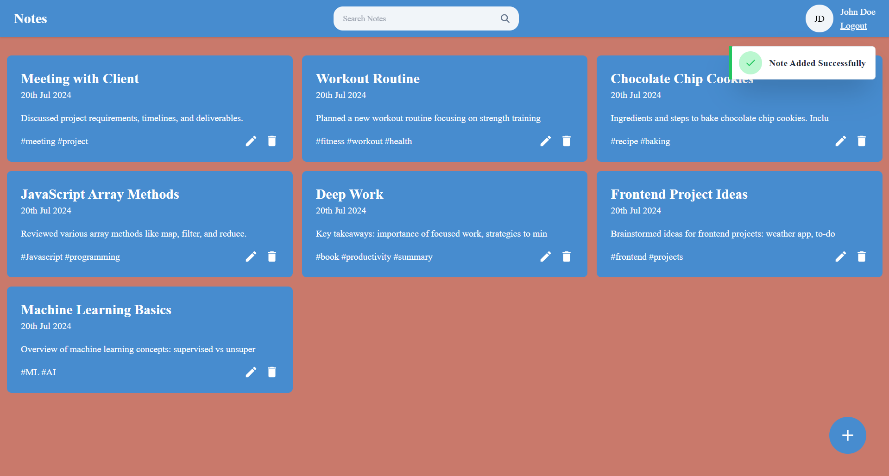

# Note App

A simple Note-taking desktop application built with the MERN stack (MongoDB, Express.js, React.js, and Node.js). This app allows users to create, read, update, and delete notes.



## Features

- **Create Notes**: Add new notes with title, content as well as tags.
- **Read Notes**: View all your notes.
- **Update Notes**: Edit existing notes.
- **Delete Notes**: Remove notes from the list.

## Tech Stack

- **Frontend**: React.js, TailwindCSS
- **Backend**: Node.js, Express.js
- **Database**: MongoDB

## Installation

### Prerequisites

Ensure you have the following installed:

- [Node.js](https://nodejs.org/) (v14 or higher)
- [MongoDB](https://www.mongodb.com/try/download/community) (or use a cloud service like [MongoDB Atlas](https://www.mongodb.com/cloud/atlas))

### Getting Started

1. **Clone the Repository**

   ```bash
   git clone https://github.com/Shreyarai-1503/Full-Stack-Note-app.git
   cd Full-Stack-Note-app

2. **Setup .env file in backend folder**

   ```bash
   PORT=...
   MONGODB_URI=...
   SECRET_KEY=...your_JWT_secret_key

3. **Install Backend Dependencies and start**

    ```bash
    cd backend
    npm install
    npm start

4. **Install Frontend Dependencies and run**

    ```bash
    cd frontend
    npm install
    npm run dev

5. **Dependencies**

    ```bash
    bcryptjs@^2.4.3 
    cors@^2.8.5 
    dotenv@^16.4.5 
    express@^4.19.2 
    jsonwebtoken@^9.0.2 
    mongoose@^8.5.1 
    nodemon@^3.1.4


    axios@^1.7.2 
    moment@^2.30.1 
    react@^18.3.1 
    react-dom@^18.3.1 
    react-icons@^5.2.1 
    react-modal@^3.16.1 
    react-router-dom@^6.25.0